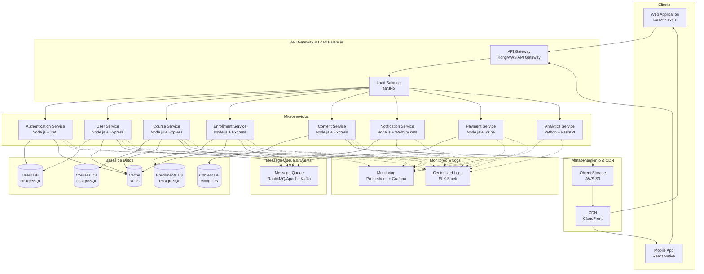
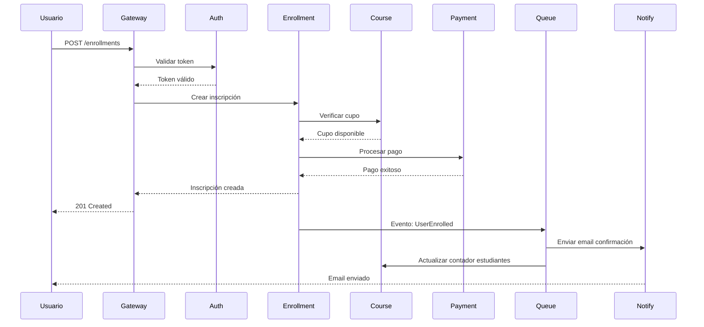

# Arquitectura del Sistema - Plataforma E-Learning

## Descripción General
La plataforma E-Learning está diseñada siguiendo una arquitectura de **microservicios**, lo que permite escalabilidad independiente, despliegue continuo y mantenimiento simplificado de cada componente del sistema.

---

## Diagrama de Arquitectura

---

## Componentes Principales

### 1. Frontend Layer (Capa de Presentación)

#### Web Application
- **Tecnología**: React.js / Next.js
- **Funcionalidad**: Interfaz web responsive para estudiantes y profesores
- **Características**:
  - Server-Side Rendering (SSR) para SEO
  - Progressive Web App (PWA)
  - Lazy loading de componentes

#### Mobile Application
- **Tecnología**: React Native
- **Funcionalidad**: Aplicación móvil nativa para iOS y Android
- **Características**:
  - Sincronización offline
  - Notificaciones push
  - Reproducción de video optimizada

---

### 2. API Gateway & Load Balancer

#### API Gateway
- **Tecnología**: Kong / AWS API Gateway
- **Responsabilidades**:
  - Enrutamiento de peticiones
  - Autenticación y autorización inicial
  - Rate limiting
  - Transformación de requests/responses
  - API versioning

#### Load Balancer
- **Tecnología**: NGINX
- **Responsabilidades**:
  - Distribución de carga entre instancias
  - Health checks
  - SSL/TLS termination
  - Compresión GZIP

---

### 3. Microservicios

#### Authentication Service
- **Tecnología**: Node.js + Express + JWT
- **Responsabilidades**:
  - Login/Logout de usuarios
  - Generación y validación de tokens JWT
  - Refresh tokens
  - OAuth 2.0 (Google, Facebook)
  - Recuperación de contraseñas
- **Base de datos**: PostgreSQL (Users DB)
- **Cache**: Redis (tokens activos, sesiones)

#### User Service
- **Tecnología**: Node.js + Express
- **Responsabilidades**:
  - CRUD de usuarios
  - Gestión de perfiles
  - Roles y permisos
  - Preferencias de usuario
- **Base de datos**: PostgreSQL (Users DB)
- **API**: REST + GraphQL

#### Course Service
- **Tecnología**: Node.js + Express
- **Responsabilidades**:
  - CRUD de cursos
  - Categorías y etiquetas
  - Gestión de instructores
  - Publicación de cursos
  - Búsqueda y filtrado
- **Base de datos**: PostgreSQL (Courses DB)
- **API**: REST + GraphQL

#### Enrollment Service
- **Tecnología**: Node.js + Express
- **Responsabilidades**:
  - Inscripciones de estudiantes
  - Seguimiento de progreso
  - Certificados de finalización
  - Historial de aprendizaje
- **Base de datos**: PostgreSQL (Enrollments DB)
- **API**: REST + GraphQL

#### Content Service
- **Tecnología**: Node.js + Express
- **Responsabilidades**:
  - Gestión de lecciones (video, texto, quiz)
  - Upload de archivos multimedia
  - Transcodificación de videos
  - Gestión de recursos descargables
- **Base de datos**: MongoDB (Content DB - documentos flexibles)
- **Storage**: AWS S3
- **API**: REST

#### Notification Service
- **Tecnología**: Node.js + Socket.io
- **Responsabilidades**:
  - Notificaciones en tiempo real
  - Emails transaccionales
  - Push notifications
  - Alertas de sistema
- **Tecnologías adicionales**:
  - SendGrid (emails)
  - Firebase Cloud Messaging (push)
- **Comunicación**: WebSockets

#### Payment Service
- **Tecnología**: Node.js + Express
- **Responsabilidades**:
  - Procesamiento de pagos
  - Gestión de suscripciones
  - Facturación
  - Reembolsos
- **Integración**: Stripe API
- **Base de datos**: PostgreSQL (transacciones)

#### Analytics Service
- **Tecnología**: Python + FastAPI
- **Responsabilidades**:
  - Métricas de uso
  - Reportes de progreso
  - Dashboard de instructores
  - Data mining
- **Tecnologías adicionales**:
  - Pandas (análisis de datos)
  - NumPy (cálculos)
- **API**: REST

---

### 4. Capa de Datos

#### Bases de Datos Relacionales (PostgreSQL)
- **Users DB**: Datos de usuarios, autenticación, perfiles
- **Courses DB**: Información de cursos, instructores, categorías
- **Enrollments DB**: Inscripciones, progreso, certificados

**Características**:
- Transacciones ACID
- Relaciones complejas
- Integridad referencial
- Backup automático

#### Base de Datos NoSQL (MongoDB)
- **Content DB**: Contenido de lecciones, metadata de videos, recursos

**Características**:
- Esquema flexible
- Documentos JSON
- Consultas rápidas
- Escalabilidad horizontal

#### Cache (Redis)
- Sesiones de usuario
- Tokens JWT activos
- Resultados de consultas frecuentes
- Rate limiting counters

**Características**:
- In-memory storage
- TTL (Time To Live)
- Pub/Sub para eventos

---

### 5. Almacenamiento y Distribución

#### Object Storage (AWS S3)
- Videos de lecciones
- Imágenes de cursos
- Archivos descargables
- Backups de bases de datos

#### CDN (CloudFront)
- Distribución global de contenido estático
- Reducción de latencia
- Optimización de ancho de banda
- Cache de assets

---

### 6. Message Queue & Event Bus

#### RabbitMQ / Apache Kafka
- **Comunicación asíncrona** entre microservicios
- **Eventos del sistema**:
  - Usuario registrado → enviar email de bienvenida
  - Curso completado → generar certificado
  - Nuevo pago → actualizar suscripción
  - Nueva inscripción → notificar instructor

**Patrón**: Event-Driven Architecture

---

### 7. Monitoreo y Observabilidad

#### Prometheus + Grafana
- Métricas de rendimiento
- Uso de CPU/Memoria
- Latencia de APIs
- Tasa de errores
- Dashboards personalizados

#### ELK Stack (Elasticsearch, Logstash, Kibana)
- Logs centralizados de todos los servicios
- Búsqueda y análisis de logs
- Alertas en tiempo real
- Debugging de errores

---

## Patrones Arquitectónicos Aplicados

### 1. Microservicios
- **Ventaja**: Escalabilidad independiente de cada servicio
- **Ventaja**: Despliegue continuo sin afectar todo el sistema
- **Ventaja**: Tecnologías específicas por servicio

### 2. API Gateway Pattern
- **Ventaja**: Punto único de entrada
- **Ventaja**: Simplifica la autenticación
- **Ventaja**: Rate limiting centralizado

### 3. Database per Service
- **Ventaja**: Independencia de datos
- **Ventaja**: Optimización específica por servicio
- **Desafío**: Transacciones distribuidas (se usa Saga Pattern)

### 4. Event-Driven Architecture
- **Ventaja**: Desacoplamiento de servicios
- **Ventaja**: Procesamiento asíncrono
- **Ventaja**: Escalabilidad mejorada

### 5. CQRS (Command Query Responsibility Segregation)
- Separación de operaciones de lectura y escritura
- Optimización de consultas complejas
- Implementado en Analytics Service

### 6. Circuit Breaker Pattern
- Prevención de fallos en cascada
- Degradación elegante del sistema
- Implementado en llamadas entre servicios

---

## Flujo de Datos: Ejemplo de Inscripción

---

## Tecnologías Utilizadas

| Componente | Tecnología | Justificación |
|------------|------------|---------------|
| Frontend Web | React/Next.js | SSR, SEO, gran ecosistema |
| Frontend Mobile | React Native | Código compartido, rendimiento nativo |
| API Gateway | Kong | Open source, extensible, alta performance |
| Load Balancer | NGINX | Ligero, confiable, ampliamente usado |
| Backend Services | Node.js + Express | Async I/O, gran comunidad, JavaScript full-stack |
| Analytics | Python + FastAPI | Excelente para data science, rápido |
| BD Relacional | PostgreSQL | ACID, confiable, features avanzados |
| BD NoSQL | MongoDB | Flexible, escalable horizontalmente |
| Cache | Redis | In-memory, rápido, pub/sub |
| Queue | RabbitMQ | Confiable, múltiples patrones de mensajería |
| Storage | AWS S3 | Escalable, durable, económico |
| CDN | CloudFront | Integración con S3, global |
| Monitoring | Prometheus + Grafana | Open source, potente, visualizaciones |
| Logs | ELK Stack | Búsqueda potente, dashboards |
| Autenticación | JWT | Stateless, estándar, seguro |

---

## Estrategia de Despliegue

### Containerización
- **Docker**: Todos los microservicios containerizados
- **Docker Compose**: Desarrollo local
- **Kubernetes**: Orquestación en producción

### CI/CD Pipeline
1. **Commit** → GitHub
2. **Build** → GitHub Actions
3. **Test** → Unit + Integration tests
4. **Scan** → Security scanning
5. **Deploy** → Staging
6. **Approval** → Manual/Automated
7. **Deploy** → Production (Rolling update)

### Ambientes
- **Development**: Local con Docker Compose
- **Staging**: Kubernetes cluster (AWS EKS)
- **Production**: Kubernetes cluster multi-región

---

## Seguridad

### Autenticación y Autorización
- JWT con refresh tokens
- OAuth 2.0 para terceros
- Role-Based Access Control (RBAC)

### Comunicación
- HTTPS/TLS en todas las comunicaciones
- API Gateway con WAF (Web Application Firewall)
- Encriptación de datos sensibles en BD

### Protección
- Rate limiting por IP/usuario
- DDoS protection
- Input validation y sanitization
- SQL injection prevention
- XSS protection

---

## Escalabilidad

### Horizontal Scaling
- Auto-scaling en Kubernetes basado en CPU/memoria
- Réplicas de microservicios según demanda
- Sharding de bases de datos cuando sea necesario

### Vertical Scaling
- Upgrade de instancias para servicios críticos
- Optimización de queries

### Caching Strategy
- Cache de datos estáticos (cursos, categorías)
- Cache de sesiones de usuario
- CDN para assets

---

## Monitoreo y Alertas

### Métricas Clave (KPIs)
- Response Time (< 200ms promedio)
- Error Rate (< 0.1%)
- Uptime (99.9% SLA)
- Throughput (requests/segundo)

### Alertas Configuradas
- CPU > 80% → Auto-scaling
- Error rate > 1% → Notificación equipo
- Disco > 85% → Alerta crítica
- Servicios caídos → PagerDuty

---

## Disaster Recovery

### Backup Strategy
- **Bases de datos**: Backup diario automático
- **Archivos S3**: Versionado habilitado
- **Configuraciones**: Almacenadas en Git

### Recovery Time Objective (RTO)
- **Objetivo**: < 4 horas

### Recovery Point Objective (RPO)
- **Objetivo**: < 1 hora de pérdida de datos

---

## Roadmap Futuro

### Fase 2 (Q3 2024)
- [ ] Implementar Machine Learning para recomendaciones
- [ ] Sistema de gamificación
- [ ] Live streaming de clases

### Fase 3 (Q4 2024)
- [ ] Aplicación de escritorio (Electron)
- [ ] Integración con LMS externos (Moodle, Canvas)
- [ ] Marketplace de cursos

### Fase 4 (2025)
- [ ] VR/AR para lecciones inmersivas
- [ ] Blockchain para certificados
- [ ] AI tutoring assistant

---

**Arquitectura diseñada**: Febrero 2024  
**Versión del documento**: v1.0  
**Última actualización**: 13 de febrero de 2024
